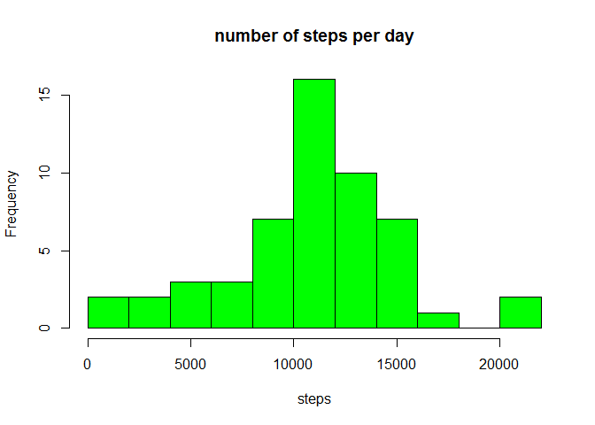
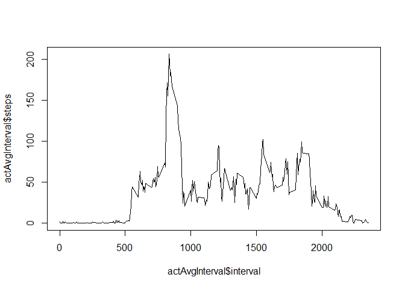
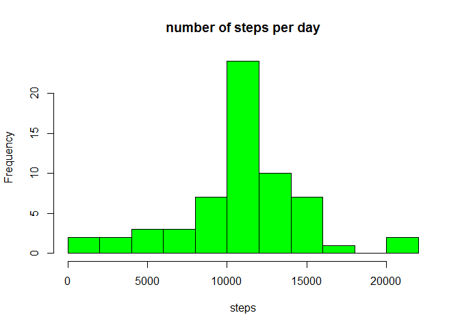
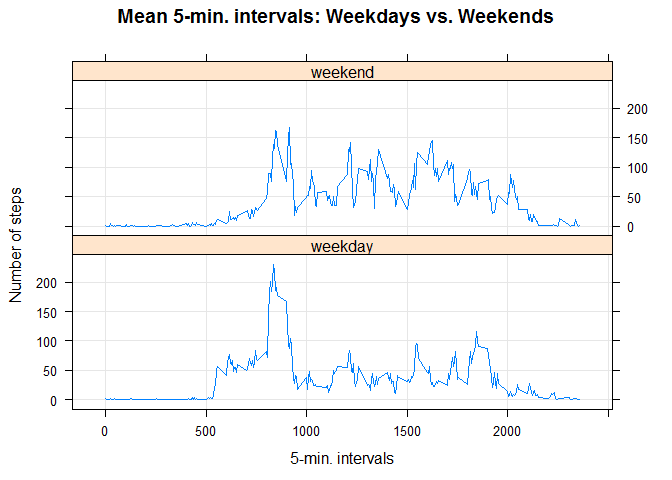

# Reproducible Research: Peer Assessment 1
Guillermo Perasso  
Friday, September 18, 2015  

Loading and preprocessing the data


```r
library(lattice)
activity <- read.csv("activity.csv")
```

### Dataset: Activity monitoring data

The variables included in this dataset are:

- steps: Number of steps taking in a 5-minute interval (missing values are coded as NA)
- date: The date on which the measurement was taken in YYYY-MM-DD format
- interval: Identifier for the 5-minute interval in which measurement was taken

The dataset is stored in a comma-separated-value (CSV) file and there are a total of 17,568 observations in this dataset.

## What is mean total number of steps taken per day?

- Missing values in the dataset are ignored.
- The total number of steps taken per day is calculated in actPday.
- An histogram shows the total number of steps taken each day.
- Then the mean and median of the total number of steps taken per day are shown.


```r
actPday <- aggregate(steps ~ date, activity, sum)
hist(actPday$steps, main="number of steps per day",xlab="steps", col="green", breaks = 10)
```

 

```r
mean(actPday$steps)
```

```
## [1] 10766.19
```

```r
median(actPday$steps)
```

```
## [1] 10765
```


## What is the average daily activity pattern?

This is a time series plot of the 5-minute interval (x-axis) and the average number of steps taken, averaged across all days (y-axis)


```r
actAvgInterval <- aggregate(steps ~ interval, activity, mean)
plot(x = actAvgInterval$interval, y = actAvgInterval$steps, type = "l") 
```

 

```r
#mean(actPday$steps)
```

The 5-minute interval, on average across all the days in the dataset, that contains the maximum number of steps is calculated here:


```r
actAvgInterval[which.max(actAvgInterval$steps), ]
```

```
##     interval    steps
## 104      835 206.1698
```

the value is 08:35 


## Imputing missing values


Calculate and report the total number of missing values in the dataset (i.e. the total number of rows with NAs)


```r
sum(is.na(activity$steps))
```

```
## [1] 2304
```

Devise a strategy for filling in all of the missing values in the dataset. 
-Selected Strategy: Replace each missing steps value buy the average number of steps calculated for the same interval over all other available dates

Create a new dataset that is equal to the original dataset but with the missing data filled in.

Make a histogram of the total number of steps taken each day and Calculate and report the mean and median total number of steps taken per day. 


```r
actFilled <- activity
for (i in 1:nrow(actFilled)){
    if(is.na(actFilled$steps[i])){
        actFilled$steps[i] <- 
            round(actAvgInterval[actAvgInterval$interval == actFilled[i,]$interval, ]$steps)
    }
}

actPdayFilled <- aggregate(steps ~ date, actFilled, sum)
hist(actPdayFilled$steps, main="number of steps per day",xlab="steps", col="green", breaks = 10)
```

 

- Show the Mean and Median of the new dataset: 


```r
mean(actPdayFilled$steps)
```

```
## [1] 10765.64
```

```r
median(actPdayFilled$steps)
```

```
## [1] 10762
```


- Do these values differ from the estimates from the first part of the assignment?

Estimating the missing values doesn't change the shape of the histogram. The median and the mean aren't much changed either.

- What is the impact of imputing missing data on the estimates of the total daily number of steps?

The total daily number of steps increases as a result of added values, specially around the mean.


## Are there differences in activity patterns between weekdays and weekends?

Create a new factor variable in the dataset with two levels - "weekday" and "weekend" indicating whether a given date is a weekday or weekend day.


```r
actFilled$day <- "weekday"
actFilled$day[weekdays(as.Date(actFilled$date), abb=T) %in% c("Sat","Sun")] <- "weekend"
```


Make a panel plot containing a time series plot (i.e. type = "l") of the 5-minute interval (x-axis) and the average number of steps taken, averaged across all weekday days or weekend days (y-axis). 


```r
meanStepInt <- aggregate(steps ~ interval + day, data=actFilled, FUN="mean")
xyplot(steps ~ interval | day, data=meanStepInt, type="l", grid=T, layout=c(1,2), 
       ylab="Number of steps", xlab="5-min. intervals", 
       main="Mean 5-min. intervals: Weekdays vs. Weekends")
```

 

According to these charts, the number of steps are high for all intervals during weekend days, whereas they are concentrated in the morning hours for weekdays.


